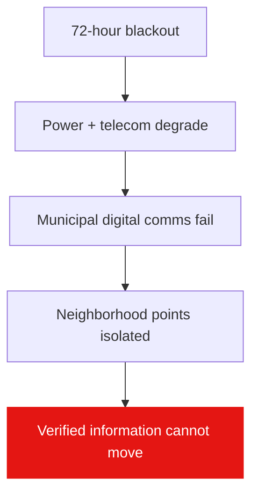

# Problem

72-hour blackout → power + telecom degrade → municipal digital communication
fails → neighborhood information points become isolated → verified information
can no longer move.

> **Challenge:** For municipal crisis coordinators who must distribute verified
> local information during a prolonged blackout, we want to enable reliable
> information delivery to neighborhood emergency points without depending on
> internet or cellular networks.
