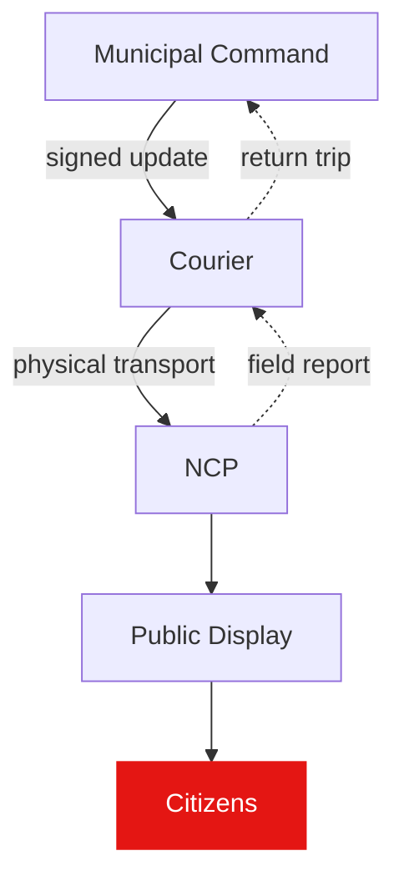
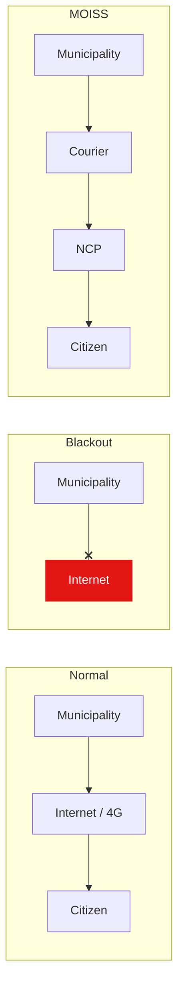

# Architecture

## Concept

## Normal network vs MOISS

## Information flow

## Critical assumption

> A courier-carried device can reliably transport authenticated crisis
> information between digitally isolated municipal locations without internet
> connectivity.
